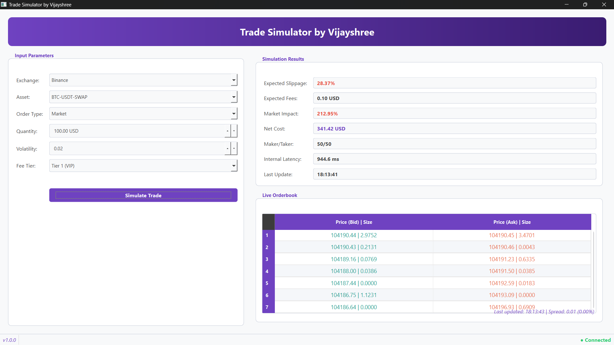

# Trade Simulator

A professional-grade trade simulation tool for cryptocurrency traders featuring real-time market data visualization, slippage modeling, and cost analysis.

## 🚀 Features

- **Real-time Market Data**  
  Connects to exchange WebSockets to receive live orderbook data.
  
- **Trade Cost Analysis**  
  Calculates slippage, market impact, and fees before executing trades.

- **Maker/Taker Prediction**  
  Estimates whether your order will be a maker or taker.

- **Modern User Interface**  
  Clean, intuitive UI with color-coded metrics for fast analysis.

- **Multi-Exchange Support**  
  Works with major exchanges including Binance, Coinbase, Kraken, and OKX.

## 🖼️ Screenshot



## 🛠 Installation

### Prerequisites

- Python 3.9 or higher  
- [PySide6 (Qt for Python)](https://pyside.org/)

### Setup Instructions

1. **Download and extract the project folder**  
   (e.g., from Google Drive or GitHub).

2. **Navigate to the project directory**:

   ```bash
   cd trade-simulator
````

3. **Create and activate a virtual environment**:

   ```bash
   python -m venv .venv
   source .venv/bin/activate      # On Windows: .venv\Scripts\activate
   ```

4. **Install dependencies**:

   ```bash
   pip install -r requirements.txt
   ```

5. **Run the application**:

   ```bash
   python -m main
   ```

## 💡 Usage

1. Select the exchange and trading pair from the dropdown.
2. Enter your desired order size in USD.
3. Adjust volatility (range: 0 to 1) if needed.
4. Choose your fee tier.
5. Click **"Simulate Trade"** to compute the results.
6. Monitor the real-time orderbook and metrics display.

## 🧠 Key Components

* **Trade Simulation Engine**
  Models to estimate market impact, slippage, and execution probabilities.

* **WebSocket Client**
  Interfaces with major exchange APIs for real-time data.

* **User Interface**
  Built with PySide6, providing responsive and modern interaction.

## ⚙️ Technical Details

The simulator combines historical and real-time data to model:

* **Slippage**:
  Difference between expected and actual execution price.

* **Market Impact**:
  Modeled using the Almgren–Chriss framework to estimate price shifts caused by your order.

* **Execution Costs**:
  Total cost including slippage, fees, and market impact.

## 📁 Project Structure

```
trade-simulator/
├── docs/                 # Documentation and screenshots
├── src/
│   ├── models/           # Simulation models
│   ├── ui/               # UI components (PySide6)
│   ├── utils/            # Helper utilities  
│   └── websocket/        # WebSocket data client
├── tests/                # Unit and integration tests
├── main.py               # Application entry point
└── requirements.txt      # Python dependencies
```

## 👩‍💻 Author

Developed by **Vijayshree**

---
