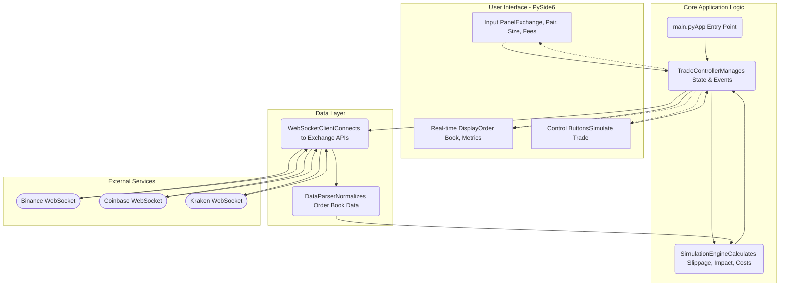

# Trade Simulator

A professional-grade trade simulation tool for cryptocurrency traders featuring real-time market data visualization, slippage modeling, and cost analysis.

## 🚀 Features

* **Real-time Market Data:** Connects to exchange WebSockets (Binance, Coinbase, etc.) to receive and display live order book data
* **Advanced Trade Cost Analysis:** Calculates potential slippage, market impact, and exchange fees before you commit to a trade
* **Maker/Taker Prediction:** Intelligently estimates whether an order of a given size is likely to be a maker (adding liquidity) or a taker (removing liquidity)
* **Modern & Intuitive UI:** A clean user interface built with PySide6, featuring color-coded metrics for quick and easy analysis
* **Multi-Exchange Support:** Designed to be extensible for major exchanges, providing a consistent simulation experience across different platforms

## 🏗️ System Architecture

This diagram illustrates the components and data flow of the Trade Simulator application. The UI, built with PySide6, captures user input and displays results. The core logic is managed by a controller that interfaces with a WebSocket client for live data and a simulation engine for calculations.



## 🖼️ Screenshot
(Screenshot image would be displayed here)

## 🛠 Installation

### Prerequisites
* Python 3.9 or higher
* An operating system that supports PySide6 (Windows, macOS, Linux)

### Setup Instructions

1. **Clone or download the repository:**
```bash
git clone https://github.com/your-username/trade-simulator.git
cd trade-simulator
```

2. **Create and activate a virtual environment:**
```bash
# For macOS/Linux
python3 -m venv .venv
source .venv/bin/activate

# For Windows
python -m venv .venv
.venv\Scripts\activate
```

3. **Install the required dependencies:**
```bash
pip install -r requirements.txt
```

4. **Run the application:**
```bash
python main.py
```

## 💡 Usage

1. Launch the application using the instructions above
2. Select the desired **Exchange** and **Trading Pair** from the dropdown menus
3. Enter your desired **Order Size** in USD
4. Adjust the **Volatility** slider (0 to 1) to model different market conditions
5. Choose your estimated **Fee Tier** to ensure accurate cost calculation
6. Click **"Connect to Feed"** to start receiving live order book data
7. Click **"Simulate Trade"** to compute and display the results
8. Analyze the metrics for **Slippage**, **Market Impact**, **Fees**, and the **Maker/Taker** prediction

## 🧠 Key Components

* **Trade Simulation Engine:** Contains the core mathematical models to estimate market impact (based on the Almgren–Chriss framework), slippage, and execution probabilities
* **WebSocket Client:** A robust client that interfaces with major exchange APIs for receiving high-frequency, real-time order book data
* **User Interface (PySide6):** A responsive and modern GUI that provides an intuitive way for users to interact with the simulator and visualize data

## ⚙️ Technical Details

The simulator provides pre-trade analytics by modeling how an order would interact with the live order book.

* **Slippage:** Calculated as the percentage difference between the expected execution price (based on the current order book) and the actual average price after your order "walks the book"
* **Market Impact:** Modeled to estimate how the price might shift as a direct result of your order's size removing liquidity
* **Execution Costs:** The total estimated cost of the trade, combining slippage, exchange fees (based on the selected tier), and market impact

## 📁 Project Structure

```
trade-simulator/
├── docs/                # Documentation and screenshots
├── src/
│   ├── models/          # Simulation models (simulation_engine.py)
│   ├── ui/              # UI components (main_window.py, style.qss)
│   └── websocket/       # WebSocket data client (client.py)
├── tests/               # Unit and integration tests
├── main.py              # Application entry point
└── requirements.txt     # Python dependencies
```

## 👩‍💻 Author

Developed by Vijayshree
